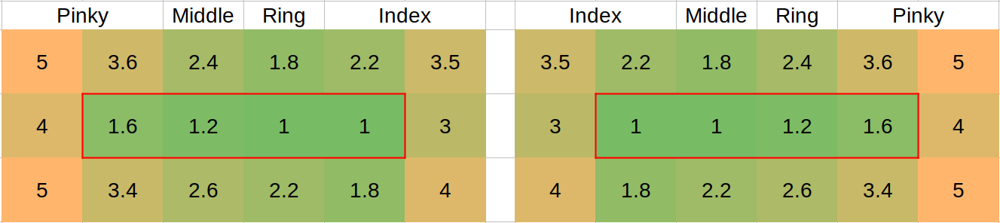

## Evaluation principle

For each language, the bigram frequencies are imported from the character statistics, as a percentage of use.

The principle is to assign a difficulty (weight) to a bigram (two keys typed consecutively). The bigram weight is multiplied by its frequency, and all the results are summed up to get a general difficulty value of the layout.

Weightlayout = sum( Weightbigram × Probabilitybigram )

The bigram weight is composed of:

- The weights assigned to the two keys, representing the relative difficulty to push them individually
- A penalty, representing the added difficulty of pushing those 2 keys one after the other

Weightbigram = Weightkey1 + Weightkey2 + Penaltykey1 & key2

The results for all layouts and languages are finally normalized compared to Qwerty in English (at 100%).

### Key base weights

The base weights are shown below. The home row is identified by a red border.

They represent the relative difficulty to hit a single key. The proposed values are for an ergonomic keyboard, with vertical columns and a comfortable home row position.

### Penalties

The penalties represent the additional difficulty of hitting 2 keys consecutively. They come on top of the base weight. They are only taken into account if the 2 keys are hit by the same hand (and are not the same key, like "aa"). By default, they are given a slightly positive value in order to favor hand alternation.

Generally, the penalties are higher if the same finger is used, and the more rows separate the 2 keys. They can be negative if the relative position makes the motion easy, such as a close "inward roll" (like "sd" on Qwerty).

| First finger | Second finger | Same row | 1 row jump | 2 rows jump | Comment     |
| :----------- | :------------ | -------: | ---------: | ----------: | :---------- |
| Index        | Index         |      2.5 |        3.5 |         4.5 | Same finger |
| Index        | Middle        |      0.5 |        1.0 |         2.0 |
| Index        | Ring          |      0.5 |        0.8 |         1.5 |
| Index        | Pinky         |      0.5 |        0.8 |         1.1 |
| Middle       | Index         |     -1.5 |       -0.5 |         1.5 | Inward roll |
| Middle       | Middle        |      N/A |        3.5 |         4.5 | Same finger |
| Middle       | Ring          |      0.5 |        1.0 |         2.0 |
| Middle       | Pinky         |      0.5 |        0.8 |         1.5 |
| Ring         | Index         |     -1.5 |       -0.5 |         1.5 | Inward roll |
| Ring         | Middle        |     -2.0 |       -0.5 |         1.2 | Inward roll |
| Ring         | Ring          |      N/A |        3.5 |         4.5 | Same finger |
| Ring         | Pinky         |      1.0 |        1.5 |         2.5 |
| Pinky        | Index         |     -1.0 |        0.0 |         1.0 | Inward roll |
| Pinky        | Middle        |     -1.0 |        0.0 |         1.5 | Inward roll |
| Pinky        | Ring          |     -1.0 |        0.0 |         1.5 | Inward roll |
| Pinky        | Pinky         |      3.0 |        4.0 |         5.5 | Same finger |
