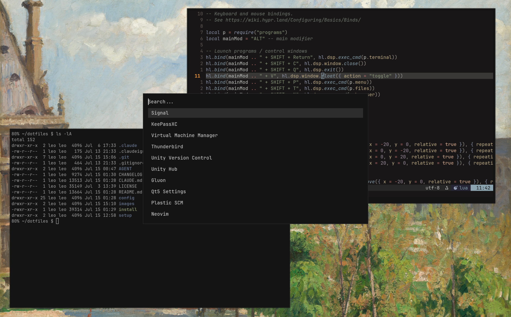

# My Dotfiles



This repository contains my personal dotfiles for configuring my development environment. It includes settings for various tools and applications that I regularly use. The setup targets a fast, keyboard-driven workflow on GNU/Linux, specifically Arch GNU/Linux with the dwl Wayland compositor. It is meant to be _practical_, not minimalist: the lean, dependency-free tooling (the `./install` script, small POSIX-`sh` helpers) sits next to heavyweight applications I need for work (game engine, .NET, VMs) - see [Non-free packages](#non-free-packages) for what that pulls in.

## Requirements

- **GNU/Linux-based operating system**
- **Git (`git`)** - for cloning the repository
- **Bash** - the `./install` script is plain Bash, no other dependencies
- **Sudo privileges** - for the system-wide (`/etc`) configuration

> Please back up your existing dotfiles before installing.

## Installation

Symlinks are managed by a small, dependency-free Bash script (`./install`). The
whole mapping lives in a single file, `setup/links.conf` - one line per link, two
columns: `<source-in-repo>  <target>`. Targets under `~` are user configs;
`/etc/…` targets are system configs and are linked via `sudo`.

Clone the repository:

```bash
git clone https://github.com/leonhardweiler/dotfiles.git ~/dotfiles
cd ~/dotfiles
```

Create all symlinks from `links.conf` (user and, via `sudo`, `/etc` targets) and
(re)activate the systemd units:

```bash
./install                 # = ./install link  (everyday: refresh symlinks + units)
```

**Fresh machine - one command:** `./install setup` runs the whole bootstrap. On
a terminal it shows a **menu of optional steps** (Enter picks the defaults); it
then links every config (implies `--force`, backing up real files to `.bak`) and
runs the selected steps:

```bash
./install setup
```

The optional steps (menu entries; each also has a flag, see below):

| Step                                                | Flag                    | Default |
| --------------------------------------------------- | ----------------------- | ------- |
| Install packages from `programs.txt`                | `--programs`            | ✓       |
| (Re)activate systemd units                          | `--systemd`             | ✓       |
| Add user to the required groups (`usermod -aG`)     | `--groups`              |         |
| Set the timezone (`/etc/localtime`)                 | `--timezone ZONE`       |         |
| Generate locales (`locale-gen`)                     | `--locale`              | ✓       |
| Deploy the getty@tty1 autologin drop-in             | `--getty-autologin`     |         |
| Passwordless sudo for `wheel` (`/etc/sudoers.d/`)   | `--sudoers`             |         |
| Rebuild the initramfs (`mkinitcpio -P`)             | `--initramfs`           |         |
| Install fonts + refresh the font cache (`fc-cache`) | `--fonts`               |         |
| Enable the Legion battery conservation mode         | `--legion-conservation` |         |
| Build + install dwl from `config/dwl/config.h`      | `--dwl`                 |         |
| Build + install wbg (wallpaper program)             | `--wbg`                 |         |

Each step is also runnable on its own for automation: `./install --<step>` runs
just those steps (no linking, no menu), e.g. `./install --timezone Europe/Vienna`
or `./install --groups --sudoers`. To skip the menu but still do the full setup,
pass the flags to `setup`: `./install setup --programs --systemd --locale`.

The scripts assume the repo lives at `~/dotfiles`; if you clone elsewhere, export
`DOTFILES_DIR` (used by `update_programs_list`) accordingly.

Useful variants:

```bash
./install status          # show state of every entry (ok / foreign link / real file / missing)
./install validate        # check links.conf (strict, read-only) - no filesystem changes
./install --user-only     # only ~ targets, never touch /etc, no sudo
./install -n              # dry run: print what would happen, change nothing
./install --force         # back up real files/dirs at the target to .bak, then link
./install unlink          # remove the symlinks this repo manages
```

> Every command validates `links.conf` first and **aborts on any problem**
> (nothing changed), reporting `links.conf:<line>: <msg>`. It rejects: a missing
> target, stray extra fields, an absolute source, a non-existent source, a
> duplicate target, a target outside `~` / `/etc` / `/usr/local`, and a glob that
> matches nothing. A glob that may legitimately be
> empty can be marked with a third `optional` field
> (`config/foo/* ~/dir optional`). Run `./install validate` on its own to check
> without linking.

> Everyday use is just `./install` (idempotent, never overwrites real files).
> `setup` is the one-shot fresh-machine bootstrap; to only (re)install packages
> without touching anything else, run `./setup/install-programs` directly.

> **Repo layout:** every config lives directly under `config/<name>/` (flat
> source paths - e.g. `config/btop/btop.conf`), and `setup/links.conf` maps each
> source to its target. Existing symlinks are always replaced; by default
> `./install` never overwrites a **real** file/dir (only symlinks are replaced) -
> use `--force` to back those up to `.bak` and replace them. `unlink` only removes
> symlinks that point back into this repo. If a source path ends in `/*`, each
> entry inside it is linked individually into the target directory, which stays
> real - used for `config/usrbin/*` -> `~/.local/bin`, so foreign entries there
> (e.g. `claude`) are left untouched.
> `setup/` holds the deployment machinery: the link map (`links.conf`), the
> package manifest (`programs.txt`), the `install-programs` bootstrap script, and
> the data lists the installer reads instead of hardcoding them - `services.txt`
> (systemd units), `groups.txt` and `fonts.txt`. The package list itself is
> regenerated by `update_programs_list` (`config/usrbin/`, on `PATH`), which the
> pacman hook also calls.

After installation, restart your shell or `source ~/.bashrc` to apply the Bash
configuration.

## Systemd Services

### System Services

The system services below are enabled automatically by `./install` (the
`system` entries in `setup/services.txt`, via `systemctl enable` - without
`--now`, so the running session is not disturbed; start them manually or reboot
to activate). To do it by hand:

```bash
sudo systemctl enable --now NetworkManager.service
sudo systemctl enable --now getty@tty1.service
sudo systemctl enable --now dnsmasq.service
sudo systemctl enable --now sshd.service
sudo systemctl enable --now iptables.service
sudo systemctl enable --now power-profiles-daemon.service
sudo systemctl enable --now systemd-timesyncd.service
sudo systemctl enable --now fstrim.timer
# libvirt: modular, socket-activated daemons instead of monolithic libvirtd
sudo systemctl enable --now virtqemud.socket
sudo systemctl enable --now virtnetworkd.socket
sudo systemctl enable --now virtstoraged.socket
```

> Note: `swtpm` (socket-activated) and PipeWire/WirePlumber (user-scope, enabled
> per-user by package presets) have no enable-able system `*.service` and are
> therefore **not** in the list.

### Battery conservation mode (Legion)

Charging stops at ~60% to spare the battery. This used to be a
`legion-conservation.service` run at every boot, which was unnecessary: the
`ideapad_acpi` driver writes the flag through to the embedded controller, and
the EC keeps it across reboots and power-offs. It is a one-shot setup step now:

```bash
./install --legion-conservation
```

The step is idempotent (a no-op when the flag is already set) and skips itself
when the sysfs entry is missing, i.e. on non-Legion hardware. By hand:

```bash
echo 1 | sudo tee /sys/bus/platform/drivers/ideapad_acpi/VPC2004:00/conservation_mode
```

### Disabled at boot (startup-time trims)

These are preset-enabled by their packages but deliberately turned **off** by
`./install` (the `disable` entries in `setup/services.txt`) to shave boot time -
they sit on / needlessly delay the critical path. To do it by hand:

```bash
sudo systemctl disable libvirtd.service            # ~1.8s on the critical path
sudo systemctl disable NetworkManager-wait-online.service
```

- **`libvirtd.service`** - the old _monolithic_ libvirt daemon. It is replaced by
  the socket-activated _modular_ daemons (`virtqemud`/`virtnetworkd`/`virtstoraged`
  above): they start on the first `qemu:///system` connection, so VMs still work
  exactly as before - libvirt just isn't started at boot anymore. Verify with
  `sudo virsh --connect qemu:///system list --all`.
- **`NetworkManager-wait-online.service`** - blocks `network-online.target` until
  a link is up; pointless on a laptop where NetworkManager brings the link up
  asynchronously after login.

Check status:

```bash
sudo systemctl status <name>.service
```

### Login-time helpers (no user units)

There are **no systemd user units**. What would otherwise want a
`.timer`/`.service` runs as a plain command from the dwl autostart
(`autostart[]` in `config/dwl/config.h`), so nothing needs to be enabled:

- **Battery warning** - a shell loop calls `bat_check` every 2 minutes:
  `while true; do ~/.local/bin/bat_check; sleep 120; done`.

PipeWire/WirePlumber/figma-agent are enabled by their own package presets and are
**not** managed here.

## Contents

| Component      | Path                               |
| -------------- | ---------------------------------- |
| Bash           | `~/.bashrc`                        |
| btop           | `~/.config/btop`                   |
| Claude Code    | `~/.claude/{skills,settings.json}` |
| dwl            | compiled + `/usr/local` session    |
| foot           | `~/.config/foot`                   |
| Git            | `~/.config/git`                    |
| KeePassXC      | `~/.config/keepassxc`              |
| MIME defaults  | `~/.config/mimeapps.list`          |
| mkinitcpio     | `/etc/mkinitcpio.conf`             |
| MPV            | `~/.config/mpv`                    |
| Neovim         | `~/.config/nvim`                   |
| wob (OSD)      | `~/.config/wob`                    |
| Pacman hooks   | `/etc/pacman.d/hooks`              |
| PipeWire       | `~/.config/pipewire`               |
| qt5ct          | `~/.config/qt5ct`                  |
| Rofi           | `~/.config/rofi`                   |
| Scripts        | `~/.local/bin`                     |
| Systemd System | `/etc/systemd/system/`             |
| Wallpapers     | `~/.local/share/wallpapers`        |
| wbg            | compiled + `/usr/local` binary     |

## My Setup

I use Arch GNU/Linux with the dwl Wayland compositor. The file `programs.txt` contains a complete list of installed packages. A pacman hook (`/etc/pacman.d/hooks`, installed via the `pacman` package) regenerates it automatically after every `pacman`/`yay` transaction. You can still refresh it manually while installing via the install script.

> Note: This setup has been primarily tested on Arch GNU/Linux. Other distributions may require adjustments.

## Non-free packages

In the interest of honesty: `programs.txt` is not a free-software-only manifest. Some tracked packages are **proprietary** and installed from the AUR:

- **`unityhub`** (and the Unity editor it manages) - proprietary game engine.
- **`plasticscm-client-gui`** - proprietary version control (Unity/PlasticSCM).
- **`figma-agent-linux-bin`** - proprietary font helper for Figma.

In addition, **`linux-firmware`** and **`amd-ucode`** ship non-free binary blobs (device firmware / CPU microcode) that the stock `linux` kernel loads. If you want a fully free system, drop the packages above and swap `linux`/`linux-firmware` for `linux-libre`/`linux-libre-firmware` (note: some hardware then loses driver support). The rest of the tooling (dwl, foot, Neovim, mpv, KeePassXC, …) is free software.

## Manual system state (not symlinked)

Some system state is not a config file this repo can symlink. Most of it is now
available as optional `./install setup` steps (see the table above), but the
commands are kept here as reference and for doing them by hand. Checklist:

- **User groups** (`./install --groups`) - add your user to the groups the
  tracked tools need:

  ```bash
  sudo usermod -aG wheel,input,kvm,libvirt,uucp,disk,lock <user>
  ```

  Group changes take effect after re-login. Conversely, drop groups whose program
  you no longer have installed, e.g. `sudo gpasswd -d <user> docker`.

- **Timezone** (`./install --timezone Europe/Vienna`):
  `sudo ln -sf /usr/share/zoneinfo/Europe/Vienna /etc/localtime`
- **Locales** (`./install --locale`): `/etc/locale.conf` and `/etc/locale.gen`
  are tracked, but the locales still have to be generated once: `sudo locale-gen`.
- **Bootloader / kernel cmdline**: the custom kernel is started via **EFISTUB**
  (see below); systemd-boot remains installed on the ESP (`/efi`) as the
  fallback. The kernel options `amd_pstate=active usbcore.autosuspend=1 quiet`
  live in the EFI boot entry resp. in `/efi/loader/entries/arch.conf`
  (`options` line) - machine-specific (`root=UUID=…`), so set them by hand
  rather than tracking the file.
- **Not tracked on purpose** (machine-specific / secrets): `/etc/hostname`,
  `/etc/fstab` (UUIDs), and NetworkManager Wi-Fi profiles
  (`/etc/NetworkManager/system-connections/*.nmconnection`, contain PSKs).
- **ESP on-demand mount** (`/etc/fstab`, machine-specific so by hand): the EFI
  partition does not need to be mounted at boot - only `bootctl` and kernel
  updates touch it. Mounting it lazily via `x-systemd.automount` keeps
  `efi.mount` (and its `systemd-fsck`) off the boot path; it is mounted
  transparently on first access and unmounted again after the idle timeout. The
  `/efi` line reads:

  ```
  UUID=1477-6A85  /efi  vfat  noauto,x-systemd.automount,x-systemd.idle-timeout=2min,rw,relatime,fmask=0077,dmask=0077,codepage=437,iocharset=ascii,shortname=mixed,utf8,errors=remount-ro  0 0
  ```

  Apply without a reboot: `sudo systemctl daemon-reload && sudo umount /efi &&
sudo systemctl start efi.automount` (pass `0` disables the boot-time fsck).

- **getty@tty1 autologin drop-in** (`./install --getty-autologin`;
  `/etc/systemd/system/getty@tty1.service.d/autologin.conf`): there is **no
  display manager**. `getty@tty1` is overridden to log `leo` in automatically
  (`agetty --autologin leo`), and the login shell then execs the dwl session from
  `~/.bash_profile` (only on tty1, only if no Wayland session is already up). The
  drop-in must be a **real copy on the root partition**, not symlinked via
  `links.conf` - systemd reads unit drop-ins early at manager start, when a
  `/home` symlink would still be a dead link. Deploy by hand:

  ```bash
  sudo install -d -m755 /etc/systemd/system/getty@tty1.service.d
  sudo install -m644 config/systemd-system/getty@tty1.service.d/autologin.conf \
      /etc/systemd/system/getty@tty1.service.d/
  sudo systemctl daemon-reload
  ```

  Because dwl is started from a plain autologin shell (not a display manager),
  the console keymap workaround that ly needed is unnecessary: no password is
  typed on the VT, and dwl applies its own xkb layout once it starts.

- **sudo** (`./install --sudoers`): this setup relies on passwordless sudo for
  the `wheel` group (`%wheel ALL=(ALL:ALL) NOPASSWD: ALL`, written to
  `/etc/sudoers.d/10-wheel-nopasswd` and validated with `visudo -c`) - a
  deliberate convenience choice; adjust to taste.

- **Claude Code runs without permission prompts** - also deliberate, and worth
  reading together with the passwordless sudo above, because the two compound.
  `config/bash/.bashrc` aliases the binary
  (`alias claude='claude --dangerously-skip-permissions'`), so every invocation
  skips the permission prompts, and `config/claude/settings.json` sets
  `"skipDangerousModePermissionPrompt": true` to drop the one-time warning about
  that mode as well. The combined blast radius is therefore "the agent can do
  anything this user can, including root via NOPASSWD sudo, without asking".
  That is the intended workflow here and the alias is meant to stay the command;
  to start Claude with prompts anyway, bypass the alias with `\claude` or
  `command claude`. If you adopt this repo, this is a decision to make
  consciously rather than inherit.

## Notes

- Some applications may require additional dependencies not covered by this repository.
- Adjust paths and configurations to your personal environment.
- Backing up existing configurations is strongly recommended.
- To update the program list without relinking, run `update_programs_list` (on
  `PATH` via `~/.local/bin`; the same script the pacman hook uses).
- To install all packages from `programs.txt`, run `./setup/install-programs`

### Screen locker (waylock)

dwl's `lockcmd` is [waylock](https://codeberg.org/ifreund/waylock), replacing the
former hyprlock. waylock has **no config file** - it is configured entirely
through CLI flags, so the whole configuration lives in `lockcmd[]` in
`config/dwl/config.h` and changing it means rebuilding (`./install --dwl`):

```c
static const char *lockcmd[] = { "waylock", "-ignore-empty-password",
                                 "-init-color", "0x191414",
                                 "-input-color", "0xdddddd",
                                 "-input-alt-color", "0x999999",
                                 "-fail-color", "0xaa2222", NULL };
```

waylock only ever paints the whole screen in one solid color, which one
depending on the state (locked / input received / authentication failed). The
following hyprlock features therefore have **no equivalent** and are gone:

- screenshot background and `blur_passes`
- the input field as such - size, outline thickness, rounding, placeholder text,
  font and font color, `fade_on_empty`, positioning
- `hide_cursor`
- `fail_timeout` (waylock has no configurable delay after a failed attempt)

What carried over: `ignore_empty_input` -> `-ignore-empty-password`, the
background color -> `-init-color`, the outline color -> `-input-color`.

### New Initramfs

`mkinitcpio.conf` is tracked and linked to `/etc/mkinitcpio.conf` via `links.conf`
(source `config/mkinitcpio/mkinitcpio.conf`). After modifying it, regenerate the
initramfs with `./install --initramfs`, or by hand:

```bash
sudo mkinitcpio -P
```

`mkinitcpio -P` now only rebuilds the stock `linux` preset. The custom kernel
(`vmlinuz-custom-r17`) **boots without an initramfs** (`root=PARTUUID=…`; all boot
drivers are `=y`), so its former `custom.preset` and the `initramfs-custom-r17.img`
have been removed. The custom boot entry
`/efi/loader/entries/arch-custom-r17.conf` has no `initrd` line. The `r14` entry
keeps its existing static `initramfs-custom-r14.img` as a fallback.

### EFISTUB

The custom kernel is booted **directly by the firmware**, without a bootloader
in between. Two properties make that trivial here: the kernel is built with
`CONFIG_EFI_STUB=y` (so `vmlinuz` *is* a valid EFI binary) and it boots
**without an initramfs**, so there is nothing to chain-load. The kernel command
line travels as the boot entry's optional data (UCS-2), which is what the stub
reads.

Register a kernel on the ESP with `efistub-entry` (`config/usrbin/`, needs root):

```bash
sudo efistub-entry vmlinuz-custom-r18
```

Without a second argument it reuses the command line of the **running** kernel
(`/proc/cmdline`); pass one explicitly to change it:

```bash
sudo efistub-entry vmlinuz-custom-r18 'root=PARTUUID=… rw quiet amd_pstate=active'
```

The script derives disk and partition from the ESP itself (`bootctl
--print-esp-path`, triggering the automount first) and is idempotent: an
existing entry with the same label is deleted before the new one is created, so
repeated runs do not pile up duplicates in the boot menu. `efibootmgr --create`
puts the new entry at the front of `BootOrder`.

**systemd-boot stays installed** at the ESP fallback path
(`/efi/EFI/BOOT/BOOTX64.EFI`), and that is the point: this Insyde firmware
carries no OS-created NVRAM entry of its own (it boots the disk through the
generic `EFI Hard Drive` entry). Should it ever drop our EFISTUB entry, the
machine falls back to systemd-boot and boots exactly as before. Removing the
EFISTUB entry by hand does the same:

```bash
sudo efibootmgr --delete-bootnum --bootnum <NNNN>
```

Trade-off versus systemd-boot: a new kernel is no longer a new `.conf` file in
`/efi/loader/entries/` but a new NVRAM entry, i.e. one `efistub-entry` run per
kernel revision (the old entry has a different label and has to be deleted by
hand). Also note that **CPU microcode cannot be loaded early** on this path -
without an initramfs there is nowhere to put `amd-ucode.img`. That is unchanged
from before: neither boot entry ever referenced it.

## License

Licensed under the ISC License - SPDX identifier
[`ISC`](https://spdx.org/licenses/ISC.html). The full license text is in
[`LICENSE`](LICENSE). Bundled third-party files (e.g. under `config/mpv/`) keep
their own license.
